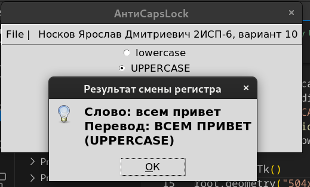

# Практическая работа № 10 #

### Тема: Отладка программы с использованиием специализированных средств отладки ###

### Цель: Приобретение навыков составления программ с испльзованием циклических структур ###

#### Ход работы ####

##### Задание: #####

> (вариант 10) Создать меню с командами: Begin, Work, About. При выборе команды About открывается окно с информацией о разработчике. При выборе команды Begin открывается диалоговое окно, содержащее:
поле ввода типа TEdit с меткой Input word;
группу из двух переключателей (Upper c ase, Lower case) типа TRadioGroup; Q кнопку типа TButton.
Обеспечить возможность ввода слова и выбора режима перевода в верхний или нижний регистр в зависимости от положения переключателей. При выборе команды Work открывается диалоговое окно с результатом перевода. 

##### Контрольный пример: #####
> Жму UPPERCASE, перехожу File -> Begin: ввожу `всем привет`, перехожу File -> Work: получаю: ... Перевод: ВСЕМ ПРИВЕТ
>
> Жму lowercase, перехожу File -> Begin: ввожу `ВСЕМ ПОКА`, перехожу File -> Work: получаю: ... Перевод: всем пока
>
> Перехожу File -> About: получаю: Разработчик: Ярик Носков, ака: github.com/YaroStrike

##### Системный анализ: #####
| Входные данные  | Выходные данные | Погашение условий|
| --------------- | --------------- | ---------------- |
| Переход в File -> Begin|Введите слово: ____| Begin|
| Переход в File -> Work| ...Перевод:..| Work|
| Переход в File -> About|Ярик Носков, ака: github.com/YaroStrike| About обо мне
##### Блок-схема: #####

##### Код программы: #####
```python
import tkinter as tk
from tkinter import simpledialog, messagebox

def about_info():
    messagebox.showinfo("About", "Разработчик: \nЯрик Носков, ака: github.com/YaroStrike")

def translate():
    global word, case
    word = simpledialog.askstring("Input word", "Введите слово:")
    case = "UPPERCASE" if var.get() == 0 else "lowercase"
def show_translation():
    messagebox.showinfo("Результат смены регистра", f"Слово: {word}\nПеревод: {word.upper() if var.get() == 0 else word.lower()} ({case})")

root = tk.Tk()
root.geometry("504x180")
root.title("АнтиCapsLock")

menu = tk.Menu(root)
root.config(menu=menu)

file_menu = tk.Menu(menu)
menu.add_cascade(label="File |", menu=file_menu)
menu.add_cascade(label="Носков Ярослав Дмитриевич 2ИСП-6, вариант 10")
file_menu.add_command(label="Begin", command=translate)
file_menu.add_command(label="Work", command=show_translation)
file_menu.add_command(label="About", command=about_info)

var = tk.IntVar()
radio_group = tk.Radiobutton(root, text="lowercase", variable=var, value=1)
radio_group.pack()
radio_group = tk.Radiobutton(root, text="UPPERCASE", variable=var, value=0)
radio_group.pack()

root.mainloop()
```
##### Результат работы программы: #####

* Скриншоты:





##### Вывод по проделанной работе: #####

> Это было легче, чем что-нибудь типа 9 пр.