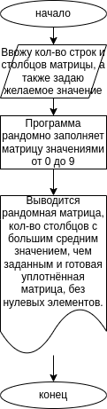
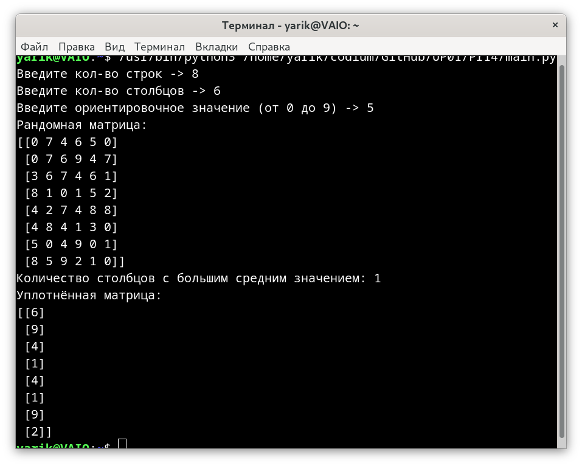
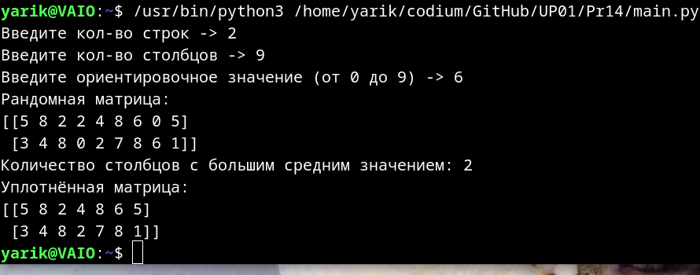
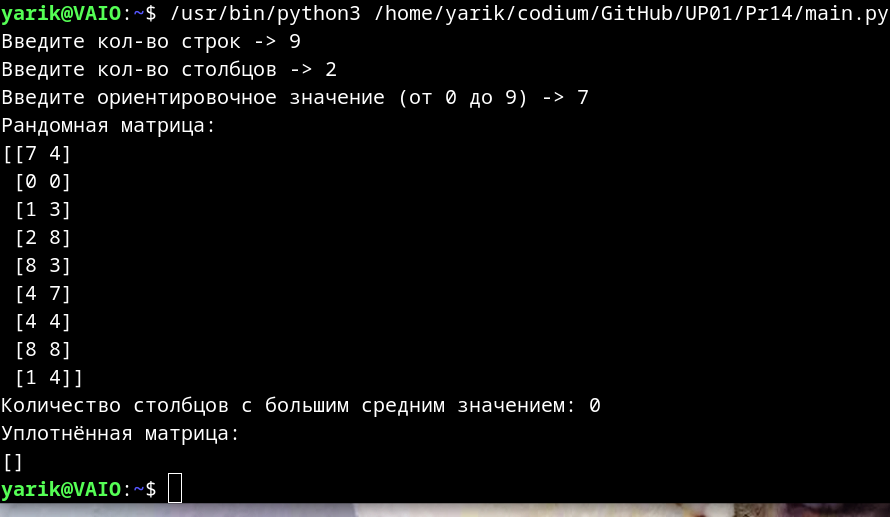

# Практическая работа № 14 #

### Тема: Выбор стратегии тестированния ###

### Цель: Приобретение навыки составления программ с испльзованием одномерных массивов ###

#### Ход работы ####

##### Задание: #####

> (вариант 10) Человек вводит размер целочисленной матрицы (в ширину и длину) и желаемую величину от 0 до 9, значения клеток матрицы случайны от 0 до 9. Программа выводит количество столбцов, среднее арифметическое которых больше желаемой величины. Затем выводится уплотнённая матрица, без столбцов в которых есть хотя бы один 0. 

##### Контрольный пример: #####
> Ввожу кол-во строк, столбцов и любое значение. Получаю: рандомную матрицу указанного размера, затем количество строк с большим значением, чем у введённого (третьего "ориентировочного") значения и наконец уплотнённую матрицу без столбцов с нулём.

##### Системный анализ: #####
| Входные данные  | Выходные данные | Погашение условий|
| --------------- | --------------- | ---------------- |
| 8, 6, 5| т.к. значения клеток - рандомные, результат не предсказуем, пример на первом скрине|"Дана целочисленная, прямоугольная матрица. ..."
| 2, 9, 6 | пример на втором скрине| по сути в каждом вводе все условия
| 9, 2, 7|пример на третьем скрине| по сути в каждом вводе все условия
##### Блок-схема: #####

##### Код программы: #####
```python
import numpy as np

rows = int(input("Введите кол-во строк -> "))
cols = int(input("Введите кол-во столбцов -> "))
my_digit = int(input("Введите ориентировочное значение (от 0 до 9) -> "))

matrix = np.random.randint(0, 10, size=(rows, cols))

selected = np.where(np.mean(matrix, axis=0) > my_digit)[0]
bigger = len(selected)

filter_matrix = matrix[:, ~np.any(matrix == 0, axis=0)]

print("Рандомная матрица:")
print(matrix)
print("Количество столбцов с большим средним значением:", bigger)
print("Уплотнённая матрица:")
print(filter_matrix)
```
##### Результат работы программы: #####

* Скриншоты:





##### Вывод по проделанной работе: #####

> Консоль! Консоль, вы все т.т.т... акак же комп, ну даа