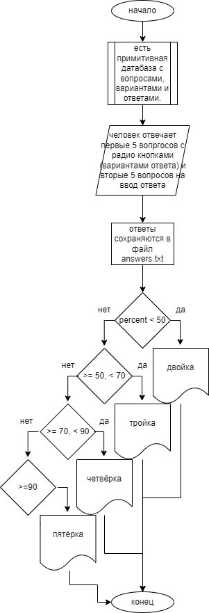
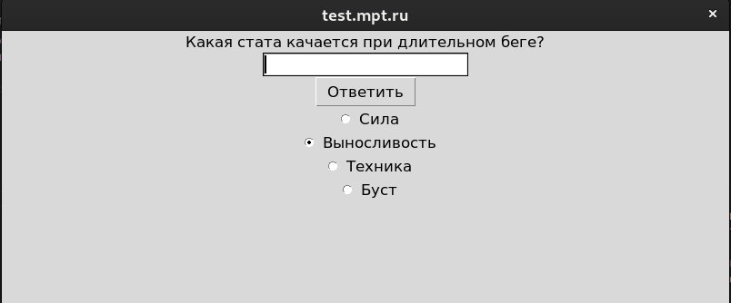
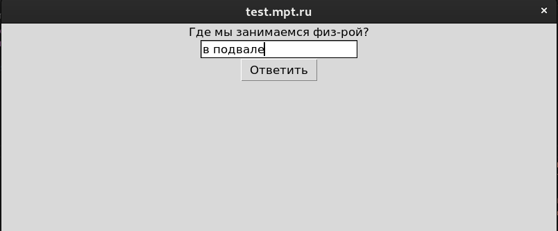
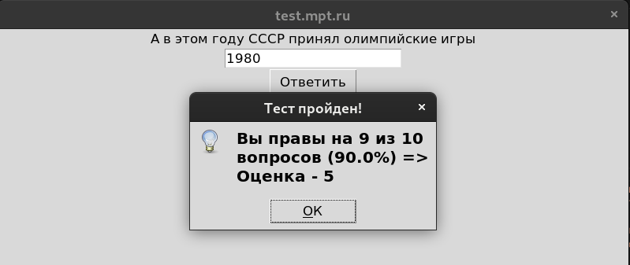

# Практическая работа № 4 #

### Тема: Внешнее проектирование (разработка внешней спецификации) ###

### Цель: Приобрести навыки составления линейных программ ###

#### Ход работы ####

##### Задание: #####

> (вариант 10) Написать программу тестирования по физкультуре. 

##### Контрольный пример: #####

> Ввожу `2024; 2`, получаю: В этом месяце 29 дней. Год - високосный!
>
> Ввожу `1984; 12`, получаю: В этом месяце 31 дней. Год - високосный!
>
> Ввожу `2006; 6`, получаю: В этом месяце 30 дней. Год - невисокосный!

##### Системный анализ: #####

| Входные данные  | Выходные данные | Погашение условий|
| --------------- | --------------- | ---------------- |
| 2024; 2| ...29 дней. Год - високосный| Выполнилась корректировка високосного февраля |
| 1984; 12| ...31 дней. Год - високосный| в массиве соответствуют макс. числа ко всем месяцам|
| 2006; 6 |...30 дней. Год - невисокосный| и этот невисокосный 

##### Блок-схема: #####



##### Код программы: #####
```python
import tkinter as tk
from tkinter import messagebox

class Quiz(tk.Tk):
    def __init__(self):
        super().__init__()
        self.title("test.mpt.ru")
        self.geometry("800x300")
        self.current_question = 0
        self.score = 0
        self.questions = [
            {"вопрос": "Какая программа представляла первые олимпийские игры в древней Греции?", "варианты": ["борьба", "метание копья", "бег на один стадий", "бег на четыре стадия"], "ответ": "бег на один стадий"},
            {"вопрос": "Лучшая дистанция спринта?", "варианты": ["60м", "200м", "1км", "400м"], "ответ": "60м"},
            {"вопрос": "Лучшая дистанция кросса?", "варианты": ["60м", "200м", "1км", "400м"], "ответ": "1км"},
            {"вопрос": "Какая стата качается при длительном беге?", "варианты": ["Сила", "Выносливость", "Техника", "Буст"], "ответ": "Выносливость"},
            {"вопрос": "Сколько игроков волейбольной команды может находиться на площадке одновременно?", "варианты": ["5", "6", "7", "8"], "ответ": "6"},
            {"вопрос": "Виктор Анатольевич, ака ...", "ответ": "сенсей"},
            {"вопрос": "В каком году он стал учителем?", "ответ": "812"},
            {"вопрос": "Где мы занимаемся физ-рой?", "ответ": "в подвале" or "подвал"},
            {"вопрос": "В этом году состоялся чемпионат мира по футболу в России", "ответ": "2018"},
            {"вопрос": "А в этом году СССР принял олимпийские игры", "ответ": "1980"}
        ]
        self.create_widgets()

    def create_widgets(self):
        self.question_label = tk.Label(self, text=self.questions[self.current_question]["вопрос"])
        self.question_label.pack()
        self.input = tk.Entry(self)
        self.input.pack()
        self.options_var = tk.StringVar()
        self.option_radios = []
        self.update_options()
        self.submit_button = tk.Button(self, text="Ответить", command=self.check_answer)
        self.submit_button.pack()

    def update_options(self):
        for option_radio in self.option_radios:
            option_radio.destroy()
        self.option_radios = []
        if "варианты" in self.questions[self.current_question]:
            for i, option in enumerate(self.questions[self.current_question]["варианты"]):
                option_radio = tk.Radiobutton(self, text=option, variable=self.options_var, value=option)
                option_radio.pack()
                self.option_radios.append(option_radio)

    def check_answer(self):
        question = self.questions[self.current_question]
        correct_answer = question["ответ"]
        selected_answer = self.options_var.get()
        
        if selected_answer.lower() == correct_answer.lower():
            self.score += 1
        else:
            user_answer = self.input.get()
            if user_answer.lower() == correct_answer.lower():
                self.score += 1
            
        if self.current_question < len(self.questions) - 1:
            self.current_question += 1
            self.question_label.config(text=self.questions[self.current_question]["вопрос"])
            self.update_options()
            if "варианты" not in self.questions[self.current_question]:
                self.input.delete(0, tk.END)
        else:
            percent = (self.score) / (len(self.questions)) * 100
            if percent < 50:
                grade = "2"
            elif percent >= 50 and percent < 70:
                grade = "3"
            elif percent >= 70 and percent < 90:
                grade = "4"
            elif percent >= 90:
                grade = "5"
            with open("answers.txt", "a") as file:
                file.write(f"{self.questions[self.current_question]['вопрос']}: {selected_answer}\n")
            messagebox.showinfo("Тест пройден!", f"Вы правы на {self.score} из {len(self.questions)} вопросов ({round(percent, 2)}%) => Оценка - {grade}")
            self.destroy()

if __name__ == "__main__":
    app = Quiz()
    app.mainloop()
```
##### Результат работы программы: #####

* Выбор варианта ответа:

* Ввод своего ответа:

* Оценочка:

##### Вывод по проделанной работе: #####

> да у меня просто код не был отлажен, сейчас отлично