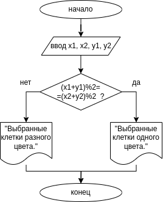
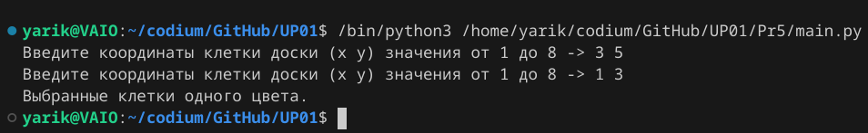
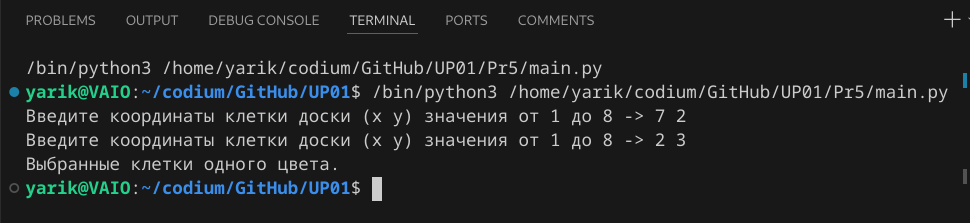
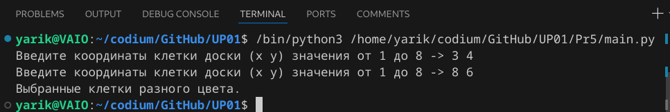

# Практическая работа № 5 #

### Тема: Внешнее проектирование (разработка тестов) ###

### Цель: Приобретение навыков составления программ на основе алгоритмов ветвления ###

#### Ход работы ####

##### Задание: #####

> (вариант 10) Даны координаты двух полей шахматной доски x1, y1, x2, y2(целые числа от 1 до 8) Проверить истинность высказывания "Данные поля имеют одинаковый цвет".

##### Контрольный пример: #####

> Ввожу 3 5; 1 3. Получаю: Выбранные клетки одного цвета.
>
> Ввожу 7 2; 2 3. Получаю: Выбранные клетки одного цвета.
>
> Ввожу 3 4; 8 6. Получаю: Выбранные клетки разного цвета.

##### Системный анализ: #####

> Входные данные: int x1, y1, x2, y2

> Промежуточные данные: 2

> Выходные данные: print()

##### Блок-схема: #####



##### Код программы: #####
```python
x1, y1 = map(int, input("Введите координаты клетки доски (x y) значения от 1 до 8 -> ").split())
x2, y2 = map(int, input("Введите координаты клетки доски (x y) значения от 1 до 8 -> ").split())


if (x1 + y1) % 2 == (x2 + y2) % 2:
    print("Выбранные клетки одного цвета.")
else:
    print("Выбранные клетки разного цвета.")
```
##### Результат работы программы: #####

* Ввод 3 5; 1 3:



* Ввод 7 2; 2 3



* Ввод 3 4; 8 6



##### Вывод по проделанной работе: #####

> Лёгкая практика относительно других
