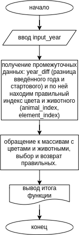

# Практическая работа № 6 #

### Тема: Внутреннее проектирование (разработка схем проекта) ###

### Цель: Приобретение навыков составления программ на основе алгоритмов множественного выбора ###

#### Ход работы ####

##### Задание: (вариант 10.) В восточном календаре принят 60-летний цикл, состоящий из 12-летних подциклов, обозначаемых названиями цвета: зелёный, красный, жёлтый белый и чёрный. В каждом подцикле годы носят названия животных: крысы, коровы, тигра, зайца, дракона, змеи, лошади, овцы, обезьяны, курицы, собаки и свиньи. По номеру года определить его название, если 1984 год - начало цикла: "год зелёной крысы". #####

> 

##### Контрольный пример: #####

> 
>
>
>
>

##### Системный анализ: #####

| Входные данные  | Выходные данные | Погашение условий|
| --------------- | --------------- | ---------------- |
| 1984          | ...год зелёного крысы...        | "1984 год - начало цикла: "год зелёной крысы""     |
| Data 2          | Result 2        | Condition 2      |
| Data 3          | Result 3        | Condition 3      |


##### Блок-схема: #####



##### Код программы: #####
```python
def Kalendar(year):
    zodiac_animals = ['крысы', 'коровы', 'тигра', 'зайца', 'дракона', 'змеи', 'лошади', 'овцы', 'обезьяны', 'курицы', 'собаки', 'свиньи']
    zodiac_elements = ['зелёного', 'красного', 'жёлтого', 'белого', 'чёрного']
    
    start_year = 1984
    start_animal_index = 0
    
    year_diff = year - start_year
    animal_index = (start_animal_index + year_diff) % 12
    element_index = year_diff // 2 % 5
    
    animal = zodiac_animals[animal_index]
    element = zodiac_elements[element_index]
    
    return f'С новым {year} годом! Это год {element} {animal}! Вам положен соицальный кредит и кошка-жена.'

input_year = int(input("Введите номер года -> "))
print(Kalendar(input_year))
```
##### Результат работы программы: #####

* Ввод 1


* Ввод 2


* Ввод 3


##### Вывод по проделанной работе: #####

> 