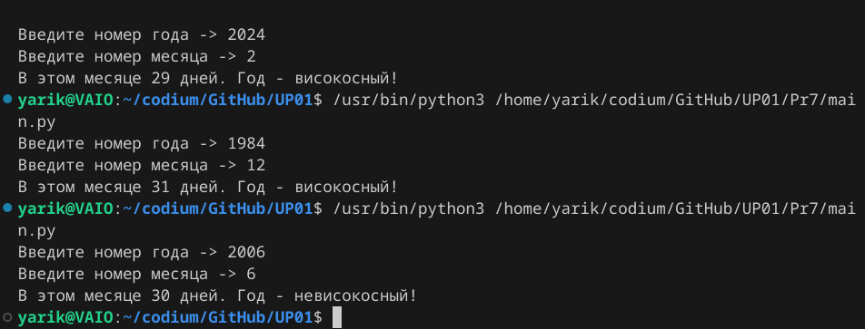
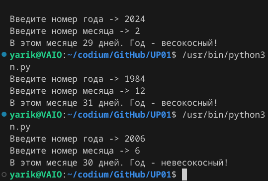

# Практическая работа № 7 #

### Тема: Разработка документа "Поянительная записка" ###

### Цель: Приобретение навыков составления программ на основе алгоритмов ветвления и выбора ###

#### Ход работы ####

##### Задание: #####

> (вариант 10) Используя функцию isleapyear из варианта 9, описать функцию monthdays, которая возвращает количество дней для М -го месяца года Y 

##### Контрольный пример: #####

> Ввожу `2024; 2`, получаю: В этом месяце 29 дней. Год - високосный!
>
> Ввожу `1984; 12`, получаю: В этом месяце 31 дней. Год - високосный!
>
> Ввожу `2006; 6`, получаю: В этом месяце 30 дней. Год - невисокосный!

##### Системный анализ: #####

| Входные данные  | Выходные данные | Погашение условий|
| --------------- | --------------- | ---------------- |
| 2024; 2| ...29 дней. Год - високосный| Выполнилась корректировка високосного февраля |
| 1984; 12| ...31 дней. Год - високосный| в массиве соответствуют макс. числа ко всем месяцам|
| 2006; 6 |...30 дней. Год - невисокосный| и этот невисокосный 

##### Блок-схема: #####



##### Код программы: #####
```python
def is_leap_year(Y):
    return Y % 4 == 0 and not (Y % 100 == 0 and Y % 400)

def month_days(M, Y):
    month = [31, 28, 31, 30, 31, 30, 31, 31, 30, 31, 30, 31]
    
    if M == 2 and is_leap_year(Y):
        return month[M - 1] + 1
    return month[M - 1]

if __name__ == "__main__":
    yr = int(input("Введите номер года -> "))
    mo = int(input("Введите номер месяца -> "))
   
    if is_leap_year(yr) == True:
        print(f"В этом месяце {month_days(mo, yr)} дней. Год - високосный!")
    else:
        print(f"В этом месяце {month_days(mo, yr)} дней. Год - невисокосный!")
```
##### Результат работы программы: #####

* Ввод входных данных:



##### Вывод по проделанной работе: #####

> В целом программа стабильна в диапазоне int, как и пр 6. 